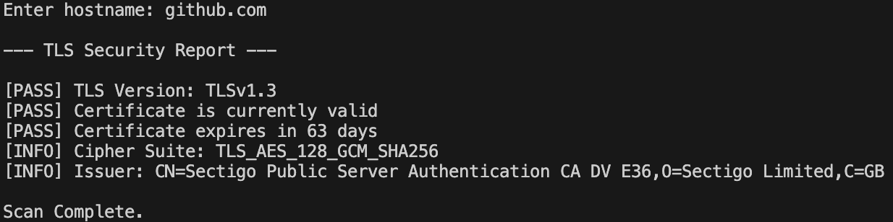
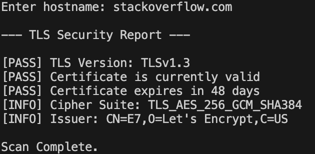

# tls-security-analyzer
Java-based TLS security analyzer that evaluates TLS versions, certificate validity, expiration status, cipher suites, and certificate issuer information.

## Example Output

These examples showcase the analyzer's output across multiple websites, illustrating differences in protocol versions, certificate status, and encryption details.

